# WalrusSign Architecture & Workflow

This document outlines the technical architecture and user workflow of the **WalrusSign** platform. You can include these diagrams directly in your hackathon submission README!

## System Architecture Diagram

The platform leverages a purely decentralized stack: a React frontend (dApp) interacts with **Walrus** for permanent decentralized storage of heavy binary data (PDFs) and the **Sui Blockchain** for immutable, fast, and secure state management (signatures and document hashes).

```mermaid
graph TD
    %% Define styles
    classDef frontend fill:#1e293b,stroke:#00d4ff,stroke-width:2px,color:#fff
    classDef walrus fill:#0f172a,stroke:#ffcc00,stroke-width:2px,color:#fff
    classDef sui fill:#0f172a,stroke:#4ade80,stroke-width:2px,color:#fff
    classDef user fill:#334155,stroke:#fff,stroke-width:2px,color:#fff

    %% Nodes
    UserA((Party A<br/>Creator)):::user
    UserB((Party B<br/>Signer)):::user

    subgraph "WalrusSign dApp (Client-Side)"
        React[React / Vite Frontend]:::frontend
        DappKit[@mysten/dapp-kit<br/>Wallet Adapter]:::frontend
        LocalHash[Local SHA-256<br/>Hasher]:::frontend
    end

    subgraph "Walrus Storage Network"
        Publisher[Walrus Publisher Node]:::walrus
        Aggregator[Walrus Aggregator Node]:::walrus
    end

    subgraph "Sui Blockchain"
        SmartContract[WalrusSign Move Contract]:::sui
        DocObject[(On-Chain Document Object<br/>- Blob ID<br/>- SHA-256 Hash<br/>- Signatures)]:::sui
    end

    %% Connections
    UserA -->|1. Uploads PDF| React
    React -->|2. Computes Hash| LocalHash
    React -->|3. POST raw binary| Publisher
    Publisher -.->|Returns Blob ID| React
    
    React -->|4. Sign Transaction| DappKit
    DappKit -->|5. Execute 'create_document'| SmartContract
    SmartContract -->|Creates| DocObject
    
    UserB -->|6. Opens Link| React
    React -->|7. Fetch via Blob ID| Aggregator
    Aggregator -.->|Returns PDF bytes| React
    React -->|8. Re-computes & Verifies Hash| DocObject
    
    UserB -->|9. Sign Transaction| DappKit
    DappKit -->|10. Execute 'sign'| SmartContract
    SmartContract -->|Mutates State| DocObject
```

---

## Document Signing Workflow (Sequence Diagram)

This sequence diagram illustrates the exact step-by-step cryptographic workflow from the moment a user uploads a document to the moment the counterparty signs it.

```mermaid
sequenceDiagram
    autonumber
    actor PartyA as Party A
    participant App as WalrusSign dApp
    participant Walrus as Walrus Network
    participant Sui as Sui Blockchain
    actor PartyB as Party B

    PartyA->>App: Drag & Drop PDF Contract
    App->>App: Compute SHA-256 Hash Locally (Privacy)
    
    rect rgb(20, 30, 50)
        Note over App,Walrus: Phase 1: Decentralized Storage
        App->>Walrus: Upload raw PDF bytes (Publisher)
        Walrus-->>App: Return immutable `blob_id`
    end

    rect rgb(20, 50, 30)
        Note over App,Sui: Phase 2: On-Chain Minting
        App->>Sui: Call `create_document(blob_id, hash, party_b)`
        Sui-->>Sui: Mint shared `Document` object
        Sui-->>App: Return `object_id`
    end

    App->>PartyA: Display Shareable Link (contains object_id)
    PartyA->>PartyB: Send Link via Email/Chat

    rect rgb(50, 30, 20)
        Note over PartyB,Sui: Phase 3: Verification & Signing
        PartyB->>App: Open Signing Link
        App->>Sui: Fetch `Document` object state
        App->>Walrus: Fetch raw PDF bytes via `blob_id` (Aggregator)
        Walrus-->>App: Return PDF
        App->>App: Recompute SHA-256 of downloaded PDF
        App->>App: Verify downloaded hash == on-chain hash
        App->>PartyB: Render PDF in UI
        PartyB->>App: Click "Sign Document"
        App->>Sui: Call `sign(document_object)`
        Sui-->>Sui: Assert signer is Party B, lock document, record timestamp
    end
    
    Sui-->>App: Transaction Success
    App->>PartyB: Display "Fully Executed"
```



### Key Architectural Highlights to Mention in Your Hackathon Pitch:
1. **Zero-Knowledge Privacy Guarantee:** Because the SHA-256 hash is computed completely locally in the browser *before* touching the blockchain, the centralized app server knows nothing. The blockchain only stores a cryptographic fingerprint, never the private contents of the document.
2. **True Immutability:** Walrus guarantees the raw binary data cannot be altered or taken down. Sui guarantees the signatures and timestamps cannot be spoofed.
3. **Decentralized Verification:** When Party B downloads the document, the frontend fetches the blob from Walrus and re-hashes it on the fly, perfectly matching it against the Sui smart contract. If even 1 pixel of the PDF is altered, the hashes will reject it.
