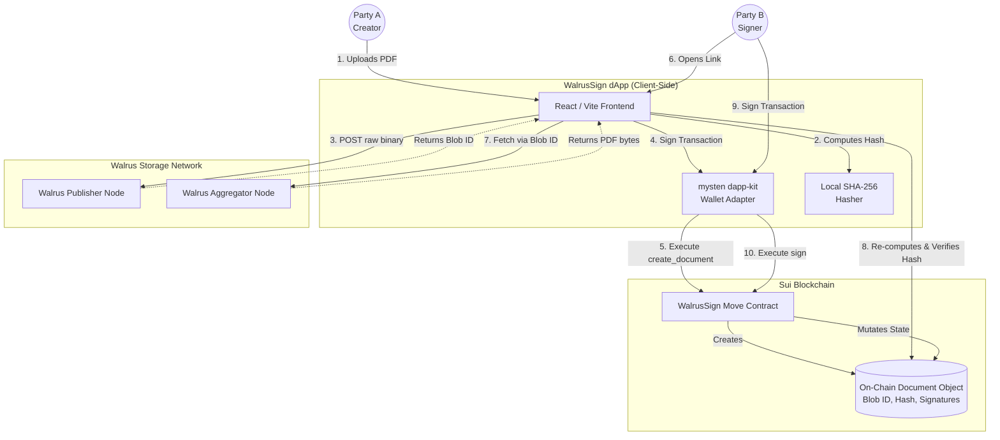
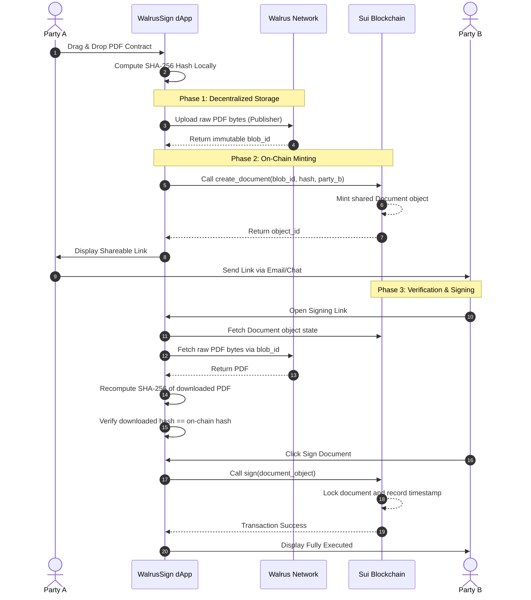

# WalrusSign

WalrusSign is a decentralized document-signing application built for the Sui and Walrus stack. It lets a user upload a PDF, hash it locally in the browser, store the file on Walrus, and record the document reference and signatures on Sui through a Move smart contract. The result is a tamper-resistant signing workflow with no centralized backend.

## What It Does

WalrusSign follows the flow described in `ARCHITECTURE.md`:

1. The creator uploads a PDF in the frontend.
2. The app computes a SHA-256 hash locally before any blockchain interaction.
3. The PDF is uploaded to Walrus and returns a blob ID.
4. The blob ID and hash are written to the Sui Move contract.
5. The recipient opens the share link and fetches the PDF from Walrus.
6. The recipient verifies the downloaded file against the on-chain hash.
7. The recipient signs the document through their wallet, and the signature is recorded on Sui.

This keeps the document contents off-chain while preserving a permanent, verifiable record of the signing process.

## Architecture Diagram



## Workflow Diagram



## Tech Stack

- Frontend: React, Vite, TypeScript, Tailwind CSS
- Storage: Walrus decentralized storage
- Blockchain: Sui
- Smart contract: Move
- Wallet integration: `@mysten/dapp-kit`

## Repository Layout

- `app/` contains the React frontend.
- `contract/` contains the Move package and contract source.
- `deploy.ps1` helps publish the contract and update the app environment.
- `ARCHITECTURE.md` contains the full diagrams and workflow details.

## Setup

```bash
cd app
npm install
npm run dev
```

Create `app/.env` with your Walrus and Sui values:

```env
VITE_WALRUS_PUBLISHER=your_walrus_publisher_url
VITE_WALRUS_AGGREGATOR=your_walrus_aggregator_url
VITE_TATUM_RPC=your_sui_rpc_url
VITE_TATUM_KEY=your_tatum_api_key
VITE_PACKAGE_ID=0x_your_move_package_id
```

## Summary

WalrusSign demonstrates a privacy-preserving, decentralized signing flow where the file stays on Walrus and the proof of signing stays on Sui. The architecture is intentionally simple for judges to follow and strong enough to verify document integrity end-to-end.